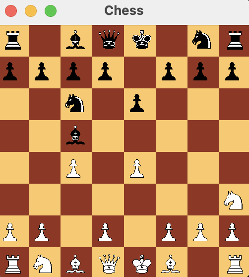

# AlphaBetaChess Project


## Overview
**AlphaBetaChess** is a sophisticated Java-based chess game that utilises artificial intelligence algorithms to challenge players. The game is built using Java Swing for its graphical interface, making it both visually appealing and interactive. At its core, it employs the alpha-beta pruning algorithm, an optimization technique for the minimax algorithm, enhancing the AI's decision-making efficiency by ignoring less promising moves.

## Features
- **Graphical User Interface**: Implements Java Swing to provide a responsive and intuitive chessboard experience.
- **Alpha-Beta Pruning Algorithm**: Optimises the AI's decision-making process, making the game challenging and engaging.
- **Move Sorting**: Improves search efficiency in the AI's algorithm by prioritizing the most promising moves.
- **Undo Functionality**: Allows players to reverse moves, enabling learning and strategy adjustments.
- **Game Modes**: Supports both human vs AI and AI vs AI gameplay, allowing players to challenge themselves or observe and learn from AI battles.

## Prerequisites
To run AlphaBetaChess, ensure you have the following installed on your system:
- **Java Development Kit (JDK)**: Version 8 or higher is required.
- **Java Runtime Environment (JRE)**: Necessary to run Java applications.

## Installation Guide
1. **Clone the repository**:
   ```bash
   git clone https://github.com/your-github-username/AlphaBetaChess.git
2. **Open the Project**:
   - Open your IDE and import the project by navigating to the directory where you cloned the repository.
3. **Build the Project**:
   - Use the build system in your IDE to compile the project. 
4. **Run the Application**:
   - In your IDE, locate the `AlphaBetaChess.java` file.
   - Right-click and select `Run AlphaBetaChess.main()` to start the game.

## How to Use
- **Start the Game**: Run the application and choose your preferred game mode (Human vs AI or AI vs AI).
- **Making Moves**: Click on a chess piece and then click on the destination square to move the piece.
- **Undo Moves**: Click the 'Undo' button to revert to the previous state.
- **Watch AI vs AI**: Select the AI vs AI mode from the menu to watch the AI play against itself, useful for understanding advanced strategies.

## Algorithms Used
### Alpha-Beta Pruning
This project implements the alpha-beta pruning algorithm to enhance the efficiency of the minimax decision rule. The algorithm reduces the computation overhead by pruning branches in the game tree that are not promising. This is crucial for chess, where the number of possible moves is extremely large.

### Move Sorting
Before applying alpha-beta pruning, the moves are sorted based on their potential to be the best choice. This heuristic significantly improves the effectiveness of pruning, as better moves are evaluated earlier, allowing suboptimal branches to be pruned sooner.


